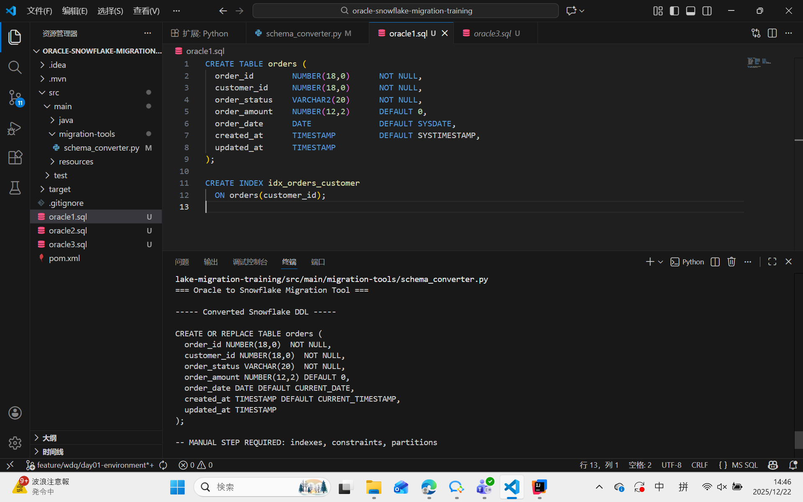
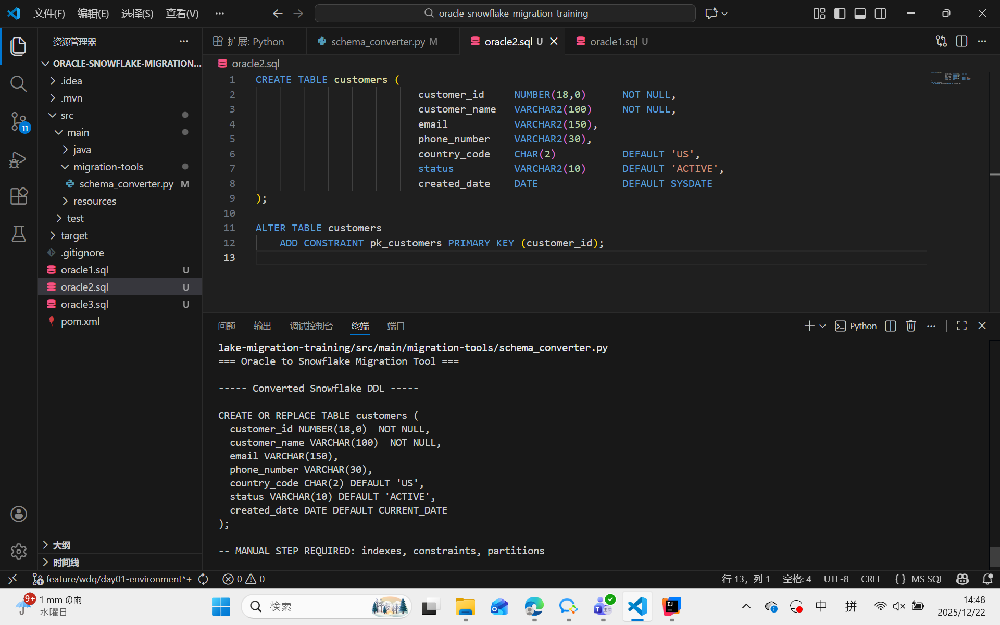
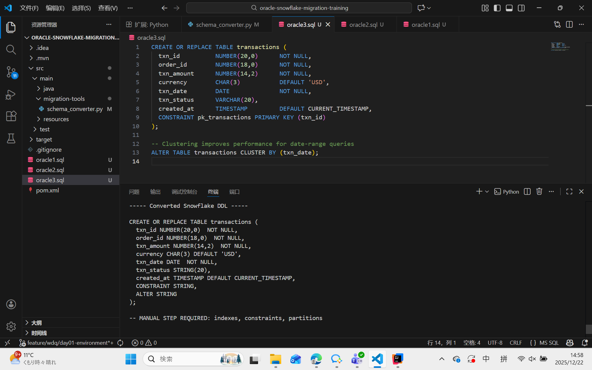

# Oracle → Snowflake Migration Tool 原理解析

该脚本用于将 Oracle DDL / SQL 自动转换为 Snowflake 可执行语法，整体设计遵循 “结构优先、语义安全、避免过度自动化” 的原则。

从实现逻辑上，脚本可以清晰地划分为 四大核心模块：
    
    数据类型映射
    
    表名提取
    
    列解析与 DDL 生成
    
    SQL 方言转换

## 一、数据类型映射（TYPE_MAPPING）
    TYPE_MAPPING = {
    "NUMBER": "NUMBER",
    "VARCHAR2": "VARCHAR",
    "CHAR": "CHAR",
    "DATE": "DATE",
    "TIMESTAMP": "TIMESTAMP",
    "CLOB": "STRING"
    }

### 1. 目的

    将 Oracle 数据类型 映射为 Snowflake 对应类型，保证表结构语义一致。

### 2. 实现原理

    在解析列定义时：
    
    先提取 Oracle 原始数据类型
    
    再通过 TYPE_MAPPING 字典查找 Snowflake 对应类型
    
    当前覆盖常见企业级类型：
    
    NUMBER
    
    VARCHAR2
    
    CHAR
    
    DATE
    
    TIMESTAMP
    
    CLOB

### 3. 示例
   VARCHAR2(20)  →  VARCHAR(20)
   NUMBER(18,0)  →  NUMBER(18,0)

## 二、表名提取（extract_table_name）
    def extract_table_name(ddl: str) -> str:
    match = re.search(
    r"CREATE\s+(?:OR\s+REPLACE\s+)?TABLE\s+((?:\"[^\"]+\"|\w+)(?:\.(?:\"[^\"]+\"|\w+))?)",
    ddl,
    re.IGNORECASE
    )

### 1. 目的

    从 Oracle DDL 中稳定提取真实表名，适配生产环境的各种写法。

### 2. 支持特性

    CREATE TABLE
    
    CREATE OR REPLACE TABLE
    
    Schema-qualified 表名
    
    如：sales.orders
    
    双引号表名
    
    如："ORDERS"

### 3. 实现逻辑

    使用正则精确匹配 CREATE TABLE 后的表名部分
    
    若存在 schema，仅保留最后一级表名
    
    移除双引号，保证 Snowflake 语法兼容

## 三、列解析与 DDL 生成
    （一）单列转换：convert_column
    def convert_column(line: str) -> str:
    line = line.strip().rstrip(",")
    parts = line.split()
    col_name = parts[0]
    oracle_type = parts[1]
    
    处理步骤
    
    去除首尾空格与尾部逗号
    
    提取列名与 Oracle 类型
    
    进行数据类型映射
    
    处理约束与默认值：
    
    NOT NULL
    
    DEFAULT
    
    Oracle 特有函数转换：
    
    SYSDATE → CURRENT_DATE
    
    SYSTIMESTAMP → CURRENT_TIMESTAMP
    
    输出示例
    order_date DATE DEFAULT CURRENT_DATE

    （二）DDL 生成：convert_ddl
    block_match = re.search(
    r"CREATE\s+(?:OR\s+REPLACE\s+)?TABLE\s+[^\(]+\((.*)\)\s*;",
    oracle_ddl,
    re.IGNORECASE | re.DOTALL
    )

核心思想

先整体抓取列定义块，再逐行解析，避免基于行状态的脆弱逻辑。

实现原理

使用正则一次性提取 () 内的完整列定义块

re.DOTALL：支持多行匹配

贪婪匹配 (.*)：获取所有列

逐行处理：

忽略空行、注释

仅处理「列名 + 类型」开头的行

调用 convert_column 转换列定义

生成 Snowflake DDL

输出示例
    CREATE OR REPLACE TABLE orders (
    order_id NUMBER(18,0) NOT NULL,
    ...
    );
    -- MANUAL STEP REQUIRED: indexes, constraints, partitions

优势：

    稳定支持跨行、缩进、注释
    
    支持 OR REPLACE、schema、双引号
    
    更贴近真实企业级 DDL

## 四、SQL 方言转换               
    def translate_sql(sql_text: str) -> str:
    sql_text = re.sub(r'\bSYSDATE\b', 'CURRENT_DATE', sql_text, flags=re.IGNORECASE)
    sql_text = re.sub(r'\bSYSTIMESTAMP\b', 'CURRENT_TIMESTAMP', sql_text, flags=re.IGNORECASE)

### 1. 作用
    
    将 Oracle SQL 方言 转换为 Snowflake 可执行语法。

### 2. 实现方式

    使用正则进行 批量安全替换
    
    可扩展为更多规则，例如：
    
    NVL → COALESCE
    
    TO_CHAR(date) → TO_VARCHAR(date)

### 3. 示例

原始 Oracle SQL：

        INSERT INTO orders(order_id, order_date)
        VALUES (1, SYSDATE);

转换后：

        INSERT INTO orders(order_id, order_date)
        VALUES (1, CURRENT_DATE);

## 五、脚本整体执行流程

    读取 Oracle DDL 文件

    调用 convert_ddl()

    生成 Snowflake DDL

    调用 translate_sql()

    完成 SQL 方言转换

    输出结果到控制台

## 六、典型 DDL 场景验证说明
### 1.

Oracle DDL 特点

使用 CREATE OR REPLACE TABLE

多个高精度 NUMBER(p,s) 数值列

行内定义 PRIMARY KEY

独立 ALTER TABLE ... CLUSTER BY 语句

包含注释、缩进，接近真实生产 DDL

该示例主要验证了脚本在复杂 DDL 场景下的稳定性：

正确识别 OR REPLACE 表名

精确映射高精度 NUMBER 类型

自动完成 CURRENT_TIMESTAMP 转换

安全忽略 Oracle 物理特性（CLUSTER BY）

这体现了工具的设计取向：只自动迁移 Snowflake 语义明确的对象。

### 2.

Oracle DDL 特点

使用 DEFAULT SYSDATE、DEFAULT SYSTIMESTAMP

包含独立的 CREATE INDEX 语句

表结构相对简单，但包含典型 Oracle 方言

说明

该示例重点展示：

SYSDATE → CURRENT_DATE

SYSTIMESTAMP → CURRENT_TIMESTAMP

SQL 方言通过正则规则安全转换

同时可以看到：

Oracle 索引未被自动迁移

避免将 OLTP 思维下的索引直接带入 Snowflake

### 3.

Oracle DDL 特点

表结构与主键定义分离

使用 ALTER TABLE ADD CONSTRAINT PRIMARY KEY

常见于规范化建模或老系统

说明

该示例体现了工具的重要原则：

表结构优先迁移

约束不盲目自动化

明确提示人工决策

