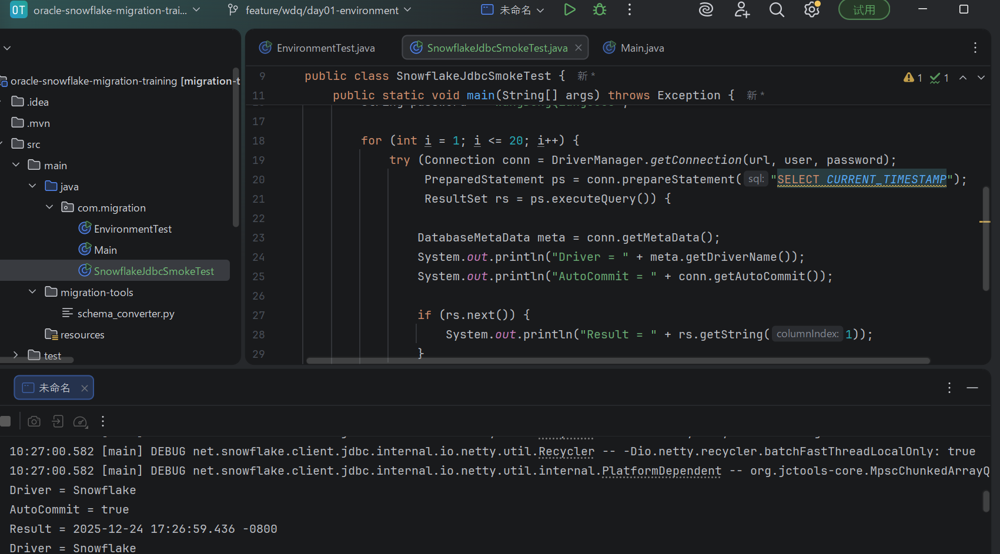

🐛 Bug 1：连接池配置错误 → Snowflake 连接超时
❌ Before（Oracle 思维直接照搬）
````
HikariConfig config = new HikariConfig();
config.setJdbcUrl(snowflakeUrl);
config.setUsername(user);
config.setPassword(password);

config.setMaximumPoolSize(50);          // ❌ 太大
config.setConnectionTimeout(3000);      // ❌ 太短

DataSource ds = new HikariDataSource(config);
````
🔍 现象

高并发时大量 timeout

Snowflake warehouse 未及时唤醒

🧠 根因

Snowflake 不适合大连接池

warehouse 是按需启动的

✅ After（Snowflake 推荐）
````
HikariConfig config = new HikariConfig();
config.setJdbcUrl(snowflakeUrl);
config.setUsername(user);
config.setPassword(password);

config.setMaximumPoolSize(10);           // ✅ 控制并发
config.setMinimumIdle(2);
config.setConnectionTimeout(15000);      // ✅ 给 warehouse 启动时间
config.setIdleTimeout(60000);

DataSource ds = new HikariDataSource(config);

````
💡 原则：Snowflake 是“少连接 + 大吞吐”

🐛 Bug 2：未关闭 ResultSet / Statement → 连接泄漏
❌ Before（最经典泄漏）
````
Connection conn = ds.getConnection();
PreparedStatement ps = conn.prepareStatement(sql);
ResultSet rs = ps.executeQuery();

while (rs.next()) {
    process(rs);
}

// ❌ 忘了关闭
conn.close();
````
🔍 现象

运行一段时间后连接池耗尽

Snowflake session 不释放

✅ After（标准答案）
````
try (Connection conn = ds.getConnection();
     PreparedStatement ps = conn.prepareStatement(sql);
     ResultSet rs = ps.executeQuery()) {

    while (rs.next()) {
        process(rs);
    }
}

````
💡 try-with-resources = JDBC 黄金法则 #1

🐛 Bug 3：Oracle 专属连接参数残留
❌ Before（配置污染）
````
Properties props = new Properties();
props.put("user", user);
props.put("password", password);
props.put("oracle.net.encryption_client", "REQUIRED"); // ❌

Connection conn =
    DriverManager.getConnection(snowflakeUrl, props);
````
🔍 现象

Snowflake JDBC 报未知参数

或 silently ignored（更危险）

🧠 根因

Oracle 网络参数对 Snowflake 无效

✅ After（干净配置）
````
Properties props = new Properties();
props.put("user", user);
props.put("password", password);
props.put("warehouse", "COMPUTE_WH"); // ✅ Snowflake 必配

Connection conn =
    DriverManager.getConnection(snowflakeUrl, props);
````

💡 迁移不是“加配置”，而是“减配置”

🐛 Bug 4：错误的事务隔离级别
❌ Before（Oracle 默认习惯）
````
Connection conn = ds.getConnection();
conn.setAutoCommit(false);
conn.setTransactionIsolation(
    Connection.TRANSACTION_SERIALIZABLE
);
````
🔍 现象

查询慢

无意义的事务开销

🧠 根因

Snowflake 是 MVCC + 云数仓

高隔离级别没有收益

✅ After（Snowflake 正解）
````
Connection conn = ds.getConnection();
conn.setAutoCommit(true); // ✅ 大多数查询无需事务

````
💡 Snowflake：能不用事务，就不用

🐛 Bug 5：混用 Oracle & Snowflake 连接池
❌ Before（真实事故级别）
````
@Bean
public DataSource dataSource() {
    if (useSnowflake) {
        return new HikariDataSource(snowflakeConfig);
    }
    return new OracleDataSource(); // ❌ 两套并存
}
````
🔍 现象

启动时报 ClassNotFound

运行时行为不可预测

🧠 根因

驱动 & 连接池混用

Spring 容器里存在多数据源污染

✅ After（明确隔离）
````
@Bean(name = "snowflakeDataSource")
public DataSource snowflakeDataSource() {
    return new HikariDataSource(snowflakeConfig);
}
````

或直接 彻底删除 Oracle 相关 Bean

💡 迁移阶段：只允许“一个真数据源”