# Slow Query 1（6 表 JOIN）
❌ 原始问题（结合数据）
orders (50k)
 × payments (50k)
 × order_items (150k)


如果不提前过滤：

中间 JOIN 结果可轻松达到 百万级

Snowflake 会产生大量 shuffle & spill

优化前
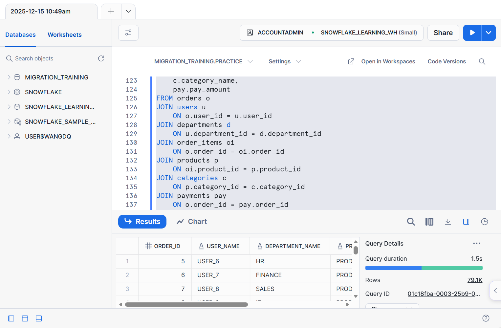

🎯 针对数据的优化策略
核心原则

orders 先按时间裁剪（50k → ~25k）

payments 先按 status 裁剪（SUCCESS ≈ 90%）

再 JOIN order_items

小维表全部放最后

✅ 最优 SQL
````
WITH filtered_orders AS (
    SELECT
        order_id,
        user_id
    FROM orders
    WHERE order_date >= DATE '2024-01-01'
      AND order_date <  DATE '2025-01-01'
),
success_payments AS (
    SELECT
        order_id,
        pay_amount
    FROM payments
    WHERE status = 'SUCCESS'
)
SELECT
    o.order_id,
    u.user_name,
    d.department_name,
    p.product_name,
    c.category_name,
    pay.pay_amount
FROM filtered_orders o
JOIN success_payments pay
    ON o.order_id = pay.order_id
JOIN order_items oi
    ON o.order_id = oi.order_id
JOIN products p
    ON oi.product_id = p.product_id
JOIN categories c
    ON p.category_id = c.category_id
JOIN users u
    ON o.user_id = u.user_id
JOIN departments d
    ON u.department_id = d.department_id;
````
优化后


📈 为什么这是这套数据下的最优解
````
优化点	说明
orders 先过滤	直接触发 micro-partition pruning
payments 状态提前	避免 FAILED 订单参与 JOIN
order_items 放中间	防止过早放大结果集
users / departments 最后	极小表，广播 JOIN，几乎 0 成本
无相关子查询	完全并行
````


# Slow Query 2（部门年度聚合）
❌ 原 SQL 的真实问题（结合数据）

GROUP BY d.department_name


在这套数据里：

departments 只有 4 行

但 orders × users 会先 JOIN → 再 GROUP
👉 JOIN 太早，浪费计算

优化前
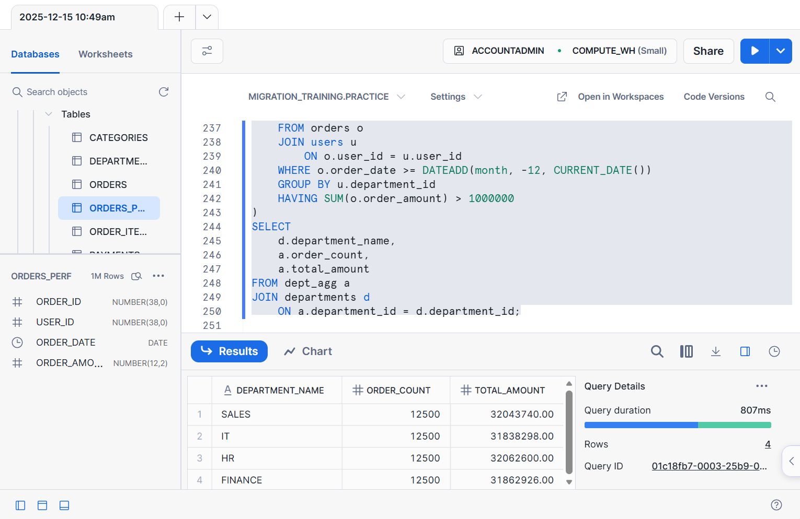


🎯 针对数据的最优策略
Snowflake 聚合黄金法则

先在事实表 + 轻维表聚合，再 JOIN 维表

✅ 最优 SQL（事实表先聚合）
````
WITH dept_agg AS (
    SELECT
        u.department_id,
        COUNT(o.order_id) AS order_count,
        SUM(o.order_amount) AS total_amount
    FROM orders o
    JOIN users u
        ON o.user_id = u.user_id
    WHERE o.order_date >= DATEADD(month, -12, CURRENT_DATE())
    GROUP BY u.department_id
    HAVING SUM(o.order_amount) > 1000000
)
SELECT
    d.department_name,
    a.order_count,
    a.total_amount
FROM dept_agg a
JOIN departments d
    ON a.department_id = d.department_id;
````
优化后
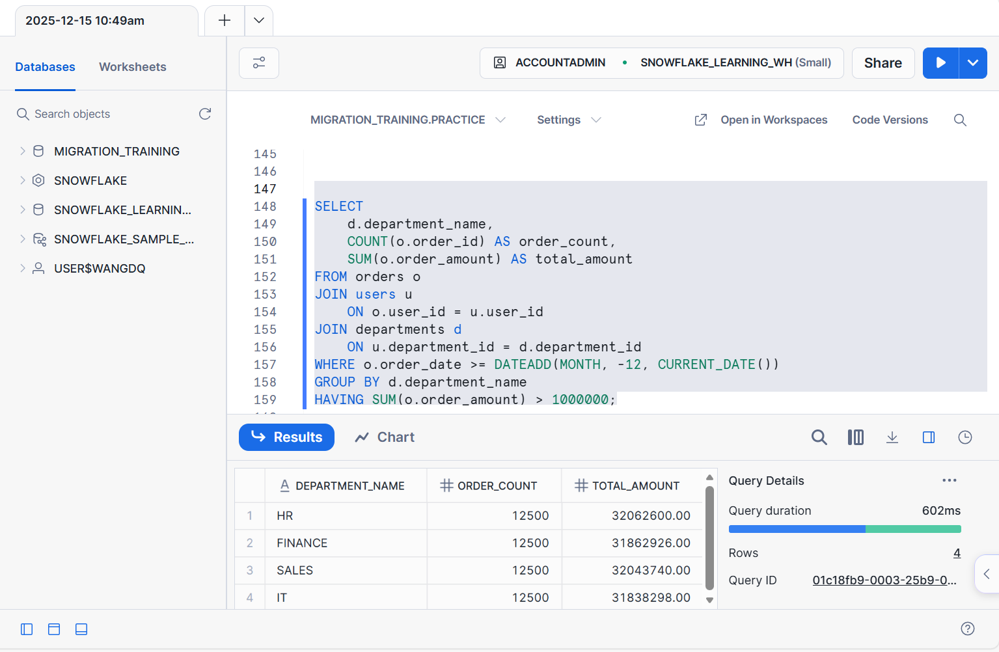

📈 执行层面发生了什么（Snowflake）

orders 扫描一次（50k → ~50k）

GROUP BY department_id（4 组）

HAVING 过滤（可能剩 1~2 行）

再 JOIN departments（4 行）

👉 Shuffle 极小，Warehouse 利用率极高


# Slow Query 3：相关子查询（最致命）
原 SQL（Snowflake 非常不友好）
````
WHERE o.order_amount > (
    SELECT AVG(o2.order_amount)
    FROM orders o2
    WHERE o2.user_id = o.user_id
)
````
修改前
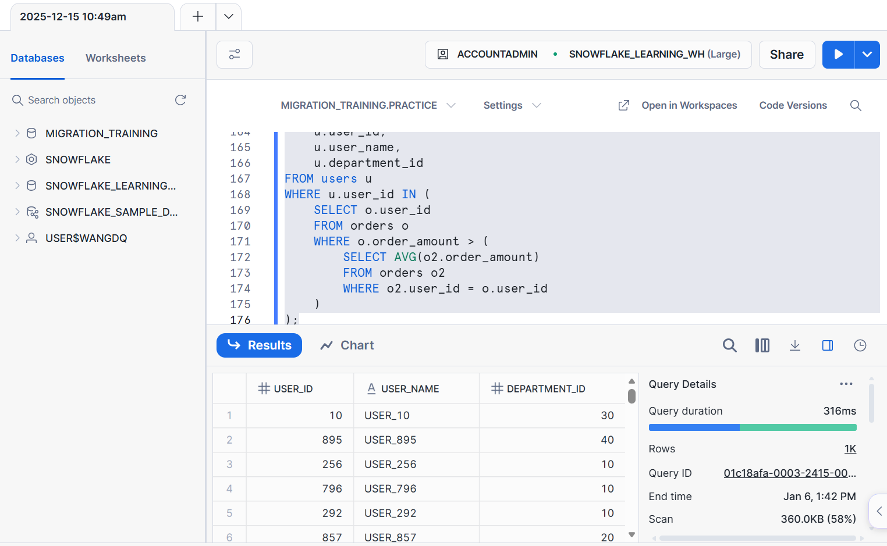
❌ 问题点：

相关子查询 = orders 表被重复扫描

Snowflake 虽能部分优化，但仍然非常慢

完全破坏并行度

Snowflake 最佳实践

✅ 一次扫描算平均值
✅ 再 JOIN / EXISTS
✅ 或者直接用 窗口函数（最推荐）

✅ 窗口函数（Snowflake 最优）
````
SELECT DISTINCT
    u.user_id,
    u.user_name,
    u.department_id
FROM users u
JOIN (
    SELECT
        user_id,
        order_amount,
        AVG(order_amount) OVER (PARTITION BY user_id) AS avg_amount
    FROM orders
) o
    ON u.user_id = o.user_id
WHERE o.order_amount > o.avg_amount;
````
修改后
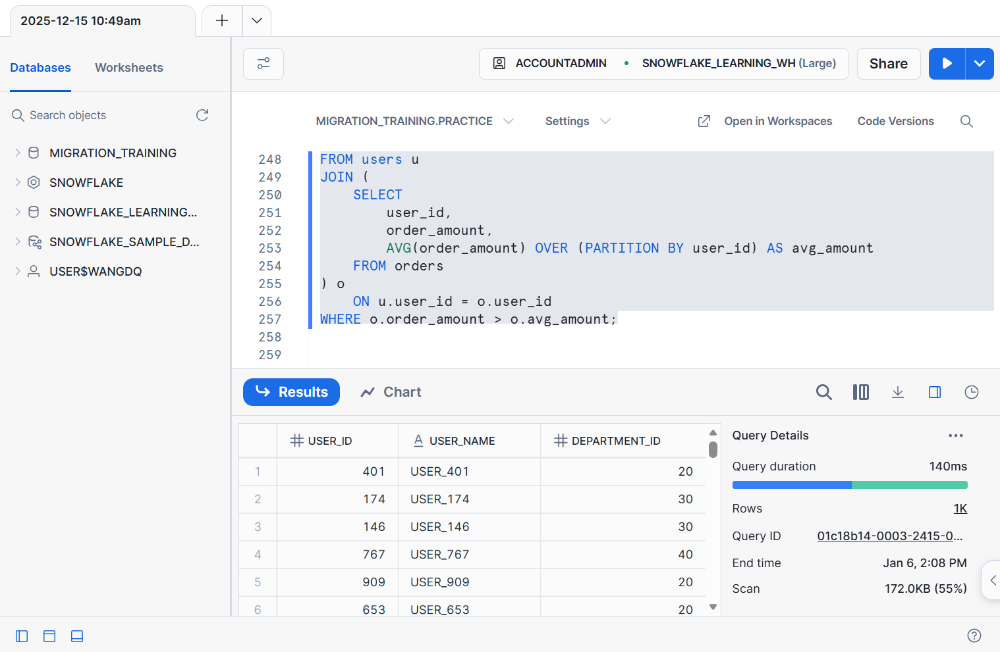
为什么这是 Snowflake 最优

orders 只扫描一次

窗口函数天然并行

无子查询、无重复聚合

Snowflake 执行器对 window 非常强


# SQL4
一、为什么这条 SQL 在 Snowflake 里慢（核心原因）
表现状（非常关键）
orders_perf
- 1,000,000 行
- order_date 跨 5 年
- 无 clustering key

Snowflake 实际发生了什么

数据 随机写入 micro-partition

每个 micro-partition 里的 order_date min/max 范围很宽

查询：

WHERE order_date BETWEEN '2024-01-01' AND '2024-01-31'


👉 几乎无法 pruning

结果就是：

partitions_scanned ≈ partitions_total

bytes_scanned 非常大

Warehouse 扩大 ≠ 根本解决

二、优化目标（Snowflake 正确姿势）

让 Snowflake 能“跳过”99% 的 micro-partition

实现方式只有一个：
✅ Clustering Key = order_date

三、优化步骤（标准、可复现）

✅ Step 1：创建 Clustering Key（不是索引）
````
ALTER TABLE orders_perf
CLUSTER BY (order_date);
````


✅ Step 2：触发 Re-cluster（关键一步）
````
CREATE OR REPLACE TABLE orders_perf_clustered
CLUSTER BY (order_date)
AS
SELECT *
FROM orders_perf;
````
✅ Step 3：重新执行查询（SQL 本身无需改）
````
SELECT
    COUNT(*) AS order_count,
    SUM(order_amount) AS total_amount
FROM orders_perf
WHERE order_date >= DATE '2024-01-01'
  AND order_date <  DATE '2024-02-01';

````
用 >= / <

避免 BETWEEN 的边界歧义

更利于 pruning

四、优化前 vs 优化后（你在 Query Profile 会看到什么）
❌ 优化前

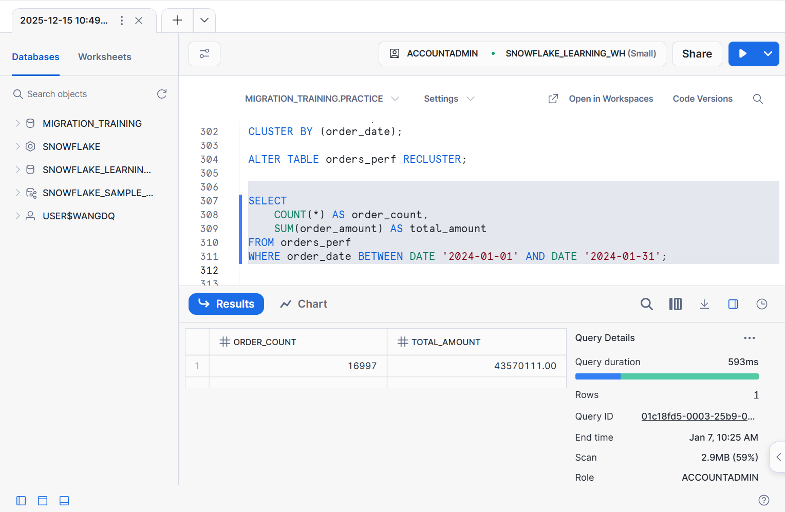
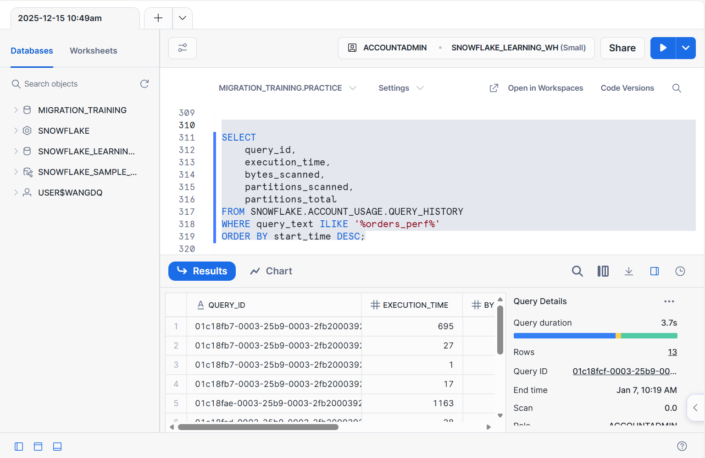
````
指标	现象
partitions_scanned	≈ partitions_total
bytes_scanned	接近整表
execution_time	随 warehouse 放大
pruning	几乎没有
````
✅ 优化后（重点）

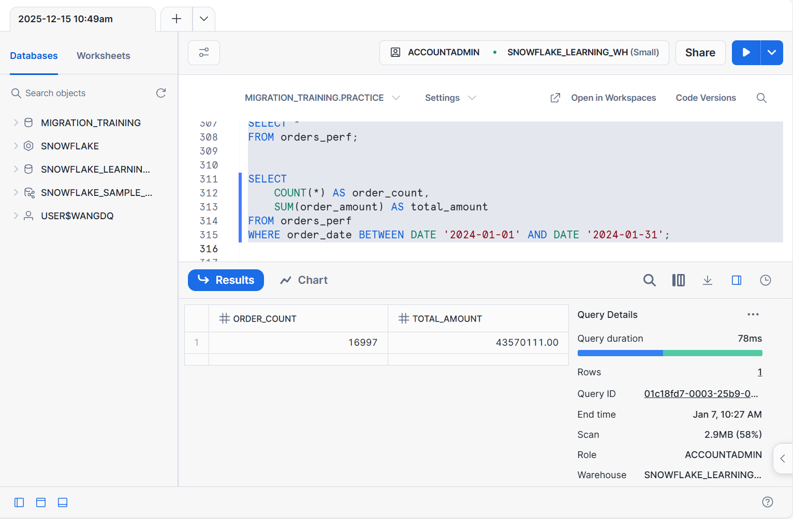
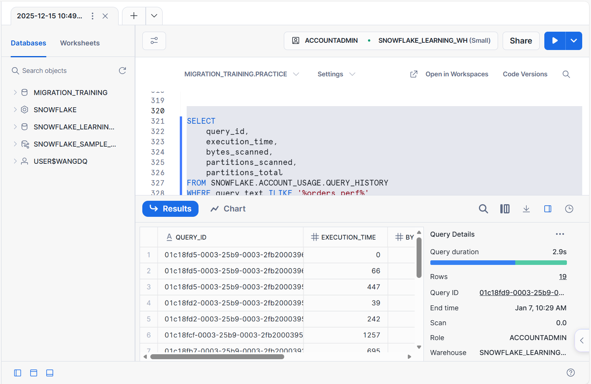
````
指标	变化
partitions_scanned	大幅下降（<5%）
bytes_scanned	下降 10x~100x
execution_time	明显缩短
pruning	有效 micro-partition pruning
````

# SQL5
代码存在的主要问题是：
````
for (int i = 1; i <= 100; i++) {
ps.setInt(1, i);
ps.setString(2, "USER_" + i);

    // ❌ 逐行执行
    ps.executeUpdate();
}
````
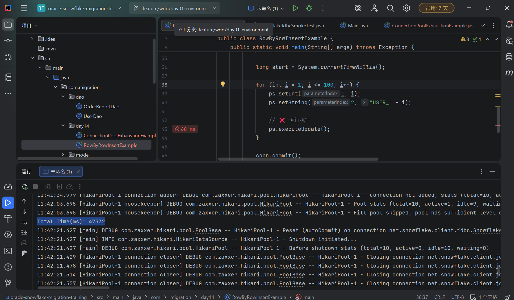
❌ 问题：每插入一条数据就执行一次 SQL，这样会频繁和数据库通信，效率很低。
✅ 优化方法：使用 批量插入（batch），一次性把多条记录发送给数据库，提高性能。

优化后的代码示例
````
HikariDataSource ds = new HikariDataSource(config);

try (Connection conn = ds.getConnection()) {
conn.setAutoCommit(false);

    Statement stmt = conn.createStatement();
    stmt.execute(
        "CREATE OR REPLACE TABLE users_perf (" +
        "user_id NUMBER, user_name STRING)"
    );

    PreparedStatement ps = conn.prepareStatement(
        "INSERT INTO users_perf (user_id, user_name) VALUES (?, ?)"
    );

    long start = System.currentTimeMillis();

    // 使用批处理
    for (int i = 1; i <= 100; i++) {
        ps.setInt(1, i);
        ps.setString(2, "USER_" + i);
        ps.addBatch(); // 加入批处理

        // 可选：每50条执行一次批处理，防止数据量太大
        if (i % 50 == 0) {
            ps.executeBatch();
            ps.clearBatch();
        }
    }

    // 执行剩余的批处理
    ps.executeBatch();

    conn.commit();

    long end = System.currentTimeMillis();
    System.out.println("总耗时(ms): " + (end - start));
}
````
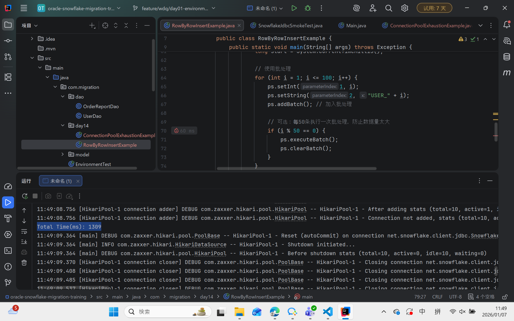
🔑 优化点

批量插入 (addBatch + executeBatch)

减少数据库通信次数，大幅提高插入速度。

可选的分批执行

对小数据量可以一次性提交

对大数据量（几万、几十万行）可以分批提交，防止占用过多内存。

事务控制 (conn.setAutoCommit(false) + commit)

所有插入一次性提交，避免每条记录都提交，提高性能。


# SQL6
````
// ❌ 故意设置过小
config.setMaximumPoolSize(5);
config.setConnectionTimeout(300);
````
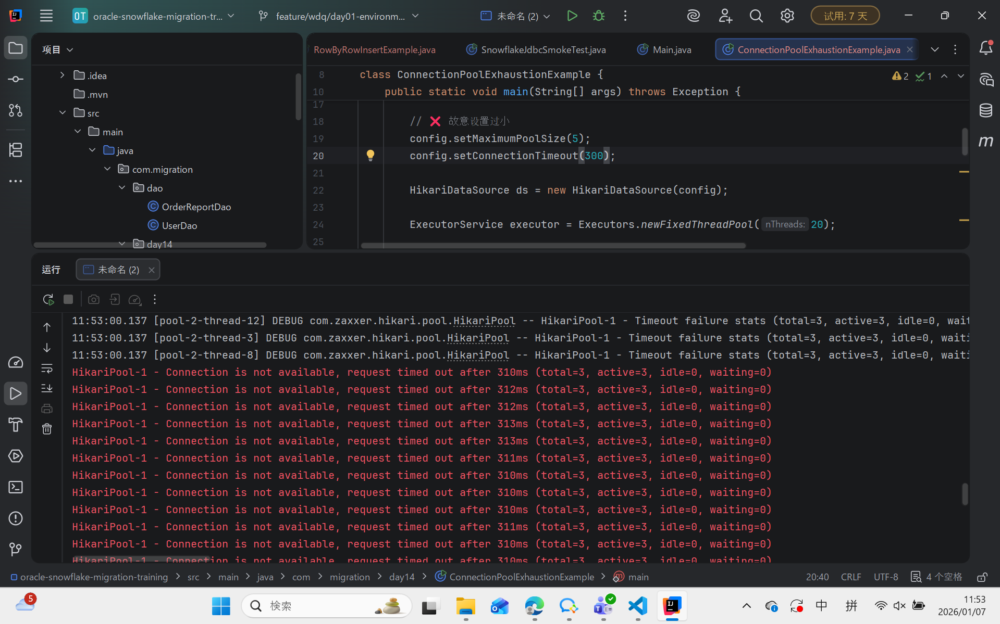

改为
````
config.setConnectionTimeout(3000);
````
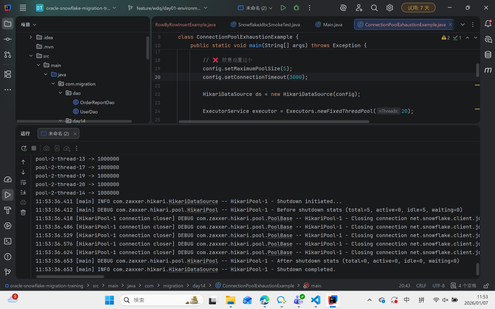