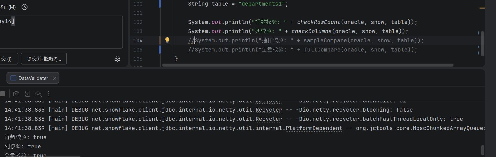
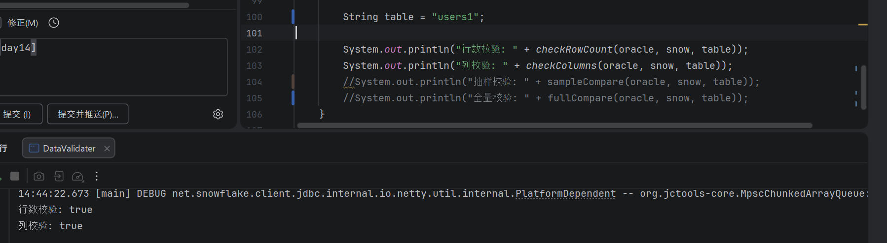
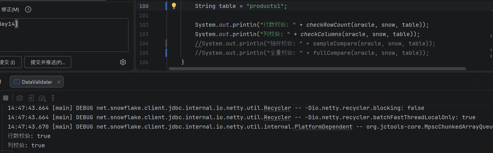
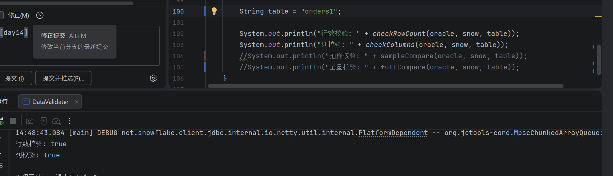
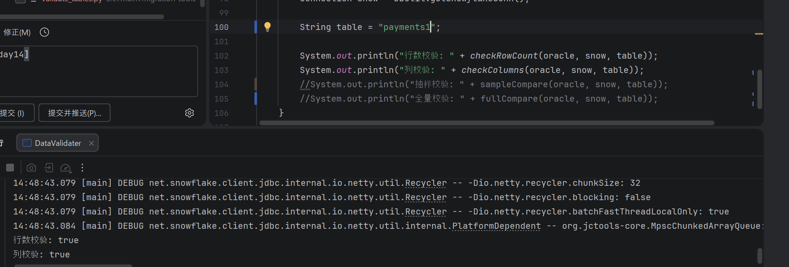

# 数据验证报告

## 1. 验证概览

### 1.1 验证统计

| 指标 | 结果   | 状态 |
|------|------|----|
| 总表数 | 5    | - |
| 验证通过 | 5    | ✅ |
| 验证失败 | 0    | ✅ |
| 通过率 | 100% | ✅ |

### 1.2 验证维度

- [x] 行数对比
- [x] 列值对比（SUM, AVG, MIN, MAX）
- [x] NULL 值统计
- [x] 主键唯一性
- [x] 外键完整性
- [x] 数据精度（小数位数）

---

## 2. 表级验证结果

### 2.1 departments1 表

**基本信息：**
- Oracle 表名：`departments1`
- Snowflake 表名：`departments1`


**行数验证：**

-- 状态：✅ 一致


**列值验证：**

-- 状态：✅ 一致


**总体状态：** ✅ **通过**

---

### 2.2 users1 表

**基本信息：**
- Oracle 表名：`users1`
- Snowflake 表名：`users1`



**行数验证：**

-- 状态：✅ 一致


**列值验证：**

-- 状态：✅ 一致


**总体状态：** ✅ **通过**

---

### 2.3 products1 表

**基本信息：**
- Oracle 表名：`products1`
- Snowflake 表名：`products1`



**行数验证：**

-- 状态：✅ 一致


**列值验证：**

-- 状态：✅ 一致


**总体状态：** ✅ **通过**

---


### 2.4 orders1 表

**基本信息：**
- Oracle 表名：`orders1`
- Snowflake 表名：`orders1`



**行数验证：**

-- 状态：✅ 一致


**列值验证：**

-- 状态：✅ 一致


**总体状态：** ✅ **通过**

---


### 2.5 payments1 表

**基本信息：**
- Oracle 表名：`payments1`
- Snowflake 表名：`payments1`



**行数验证：**

-- 状态：✅ 一致


**列值验证：**

-- 状态：✅ 一致


**总体状态：** ✅ **通过**

---

## 3. 验证脚本


```javapackage 
com.migration;

import java.security.MessageDigest;
import java.sql.*;
import java.util.ArrayList;
import java.util.Base64;
import java.util.List;
import java.util.Objects;

public class DataValidater {
    public static boolean checkRowCount(
            Connection oracleConn,
            Connection snowConn,
            String table) throws Exception {

        String sql = "SELECT COUNT(*) FROM " + table;

        ResultSet rs1 = oracleConn.createStatement().executeQuery(sql);
        ResultSet rs2 = snowConn.createStatement().executeQuery(sql);

        rs1.next();
        rs2.next();
//        System.out.println(rs1.getInt(1));
//        System.out.println(rs2.getInt(1));
        return rs1.getInt(1) == rs2.getInt(1);
    }
    public static boolean checkColumns(
            Connection conn1,
            Connection conn2,
            String table) throws Exception {

        DatabaseMetaData meta1 = conn1.getMetaData();
        DatabaseMetaData meta2 = conn2.getMetaData();

        ResultSet c1 = meta1.getColumns(null, null, table, null);
        ResultSet c2 = meta2.getColumns(null, null, table, null);

        List<String> cols1 = new ArrayList<>();
        List<String> cols2 = new ArrayList<>();

        while (c1.next()) cols1.add(c1.getString("COLUMN_NAME"));
        while (c2.next()) cols2.add(c2.getString("COLUMN_NAME"));


        return cols1.equals(cols2);
    }
    public static boolean sampleCompare(
            Connection oracleConn,
            Connection snowConn,
            String table) throws Exception {

        String sql = "SELECT * FROM " + table + " FETCH FIRST n ROWS ONLY";

        ResultSet rs1 = oracleConn.createStatement().executeQuery(sql);
        ResultSet rs2 = snowConn.createStatement().executeQuery(sql);

        ResultSetMetaData meta = rs1.getMetaData();
        int cols = meta.getColumnCount();

        while (rs1.next() && rs2.next()) {
            for (int i = 1; i <= cols; i++) {
                Object o1 = rs1.getObject(i);
                Object o2 = rs2.getObject(i);
                if (!Objects.equals(o1, o2)) return false;
            }
        }
        return true;
    }
    public static String tableHash(Connection conn, String table) throws Exception {

        MessageDigest md5 = MessageDigest.getInstance("MD5");
        Statement stmt = conn.createStatement();
        ResultSet rs = stmt.executeQuery("SELECT * FROM " + table);

        ResultSetMetaData meta = rs.getMetaData();
        int cols = meta.getColumnCount();

        while (rs.next()) {
            for (int i = 1; i <= cols; i++) {
                md5.update(String.valueOf(rs.getObject(i)).getBytes());

            }
        }
        return Base64.getEncoder().encodeToString(md5.digest());
    }
    public static boolean fullCompare(
            Connection oracleConn,
            Connection snowConn,
            String table) throws Exception {
//        System.out.println(tableHash(oracleConn, table));
//        System.out.println(tableHash(snowConn, table));
        return tableHash(oracleConn, table)
                .equals(tableHash(snowConn, table));
    }
    public static void main(String[] args) throws Exception {

        Connection oracle = DBUtil.getOracleConn();
        Connection snow = DBUtil.getSnowflakeConn();

        String table = "products1";

        System.out.println("行数校验: " + checkRowCount(oracle, snow, table));
        System.out.println("列校验: " + checkColumns(oracle, snow, table));
        //  System.out.println("抽样校验: " + sampleCompare(oracle, snow, table));
        System.out.println("全量校验: " + fullCompare(oracle, snow, table));
    }

}

