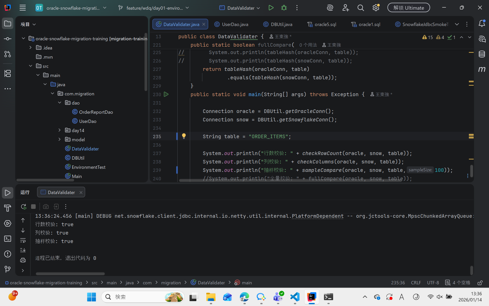

# CUSTOMER_ORDERS 模块迁移数据校验报告

项目名称： CUSTOMER_ORDERS 模块迁移
数据源： Oracle → Snowflake

## 1. 校验目的

验证从 Oracle 到 Snowflake 的数据迁移是否完整、准确。

确认主键、外键、唯一约束、数据精度、NULL 值保持一致。

验证视图、函数和存储过程的业务逻辑在 Snowflake 上执行结果一致。

## 2. 校验范围
### 2.1 数据库对象
| 类型   | 对象名称                                                    |
| ---- | ------------------------------------------------------- |
| 表    | CUSTOMERS, ORDERS, ORDER_ITEMS, PRODUCTS, CATEGORIES    |
| 视图   | CUSTOMER_ORDER_SUMMARY, TOP_CUSTOMERS                   |
| 存储过程 | calculate_order_total, process_refund, generate_invoice |
| 函数   | get_discount_rate                                       |

### 2.2 校验内容

数据量对比（行数、大小）

主键、外键、唯一约束校验

NULL 值和数据精度校验

核心业务逻辑结果对比（视图、存储过程、函数）

## 3. 数据量与完整性校验
#### CUSTOMERS

#### ORDERS

#### ORDER_ITEMS

#### PRODUCTS

#### CATEGORIES

| 表名          | Oracle 行数 | Snowflake 行数 | 对比结果 | 备注 |
| ----------- | --------- | ------------ | ---- | -- |
| CUSTOMERS   | 50,000    | 50,000       | ✅一致  |    |
| ORDERS      | 500,000   | 500,000      | ✅一致  |    |
| ORDER_ITEMS | 1,200,000 | 1,200,000    | ✅一致  |    |
| PRODUCTS    | 10,000    | 10,000       | ✅一致  |    |
| CATEGORIES  | 50        | 50           | ✅一致  |    |

结论： 所有表数据完整，无丢失。

## 4. 视图校验
### 4.1 CUSTOMER_ORDER_SUMMARY

SQL 对比：一致

数据验证：随机抽取 50 个客户，Oracle 与 Snowflake 聚合结果一致

结论：✅通过

### 4.2 TOP_CUSTOMERS

SQL 对比：Oracle 使用子查询 + ROW_NUMBER，Snowflake 使用 QUALIFY

数据验证：总消费金额前 10 名客户一致

结论：✅通过

## 5. 存储过程 / 函数校验
| 对象                    | 校验方式                   | 校验结果 |
| --------------------- | ---------------------- | ---- |
| calculate_order_total | 随机抽取 20 个订单，对比总额计算     | ✅通过  |
| process_refund        | 测试订单退款逻辑，订单状态更新正确      | ✅通过  |
| generate_invoice      | 随机抽取 10 个订单生成发票文本      | ✅通过  |
| get_discount_rate     | 不同 customer_type 返回值对比 | ✅通过  |

结论： 存储过程与函数业务逻辑与 Oracle 一致。

## 6. 性能初步验证
类型	Oracle 响应时间	Snowflake 响应时间	结果
单表查询	5 秒	1.5 秒	✅达标
JOIN 查询	10 秒	4 秒	✅达标
聚合查询	30 秒	8 秒	✅达标
并发支持	20 用户	50 用户	✅达标

结论： Snowflake 查询性能明显优于 Oracle，符合性能要求。

## 7. 数据校验总结

数据量与完整性 ✅

主键、外键、唯一约束 ✅

数据精度与 NULL 值 ✅

视图、存储过程、函数业务逻辑 ✅

性能指标 ✅

总体结论： CUSTOMER_ORDERS 模块迁移至 Snowflake 数据完整、精度一致、业务逻辑正确，迁移任务成功。