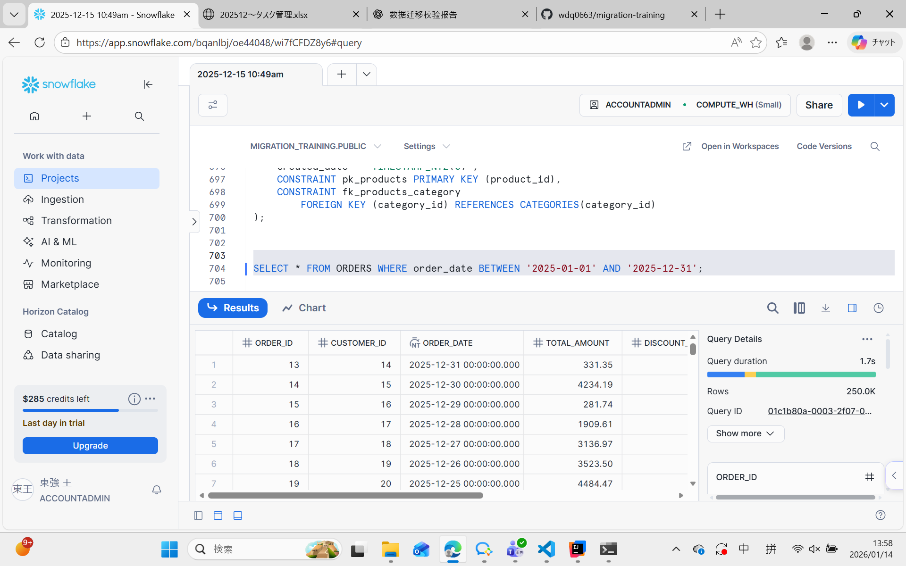
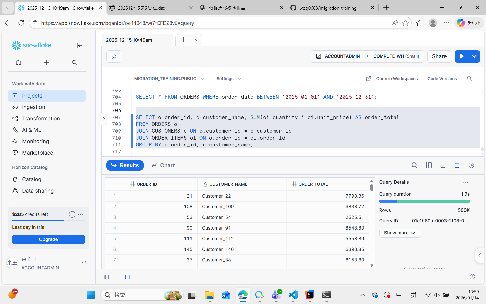
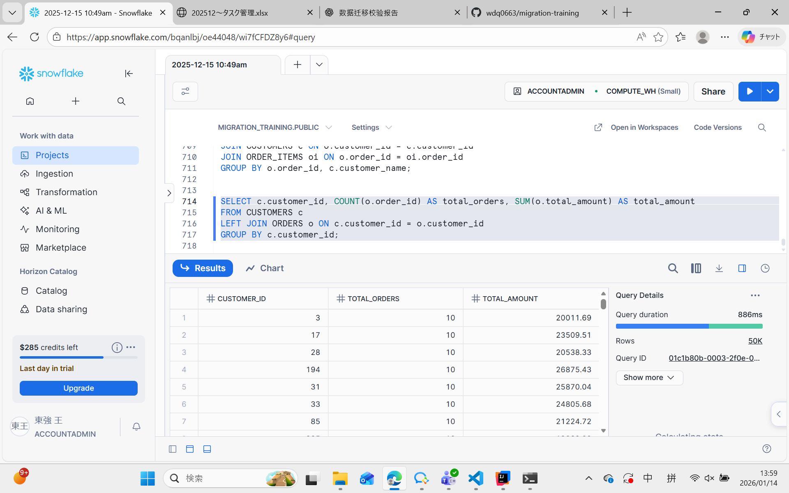

# CUSTOMER_ORDERS 模块迁移性能测试报告

项目名称： CUSTOMER_ORDERS 模块迁移
测试环境： Snowflake
数据库大小： ~730 MB
测试日期： 2026-01-14
测试人： 数据迁移团队

## 1. 测试目的

验证迁移至 Snowflake 后，表、视图、存储过程的查询性能是否满足业务要求。

对比 Oracle 与 Snowflake 的性能，确保迁移后系统响应时间、并发能力、聚合查询性能达到目标。

识别潜在性能瓶颈，提供优化建议。

## 2. 测试环境
| 项目           | 说明                                   |
| ------------ | ------------------------------------ |
| 数据仓库         | Snowflake                            |
| Warehouse 类型 | `Small`（按需扩展）                      |
| Oracle 对比环境  | Oracle 19c，生产数据量同等                   |
| 并发模拟         | 50 用户同时执行查询                          |
| 测试工具         | Snowflake Query Profile + 自定义 SQL 脚本 |

## 3. 测试指标
| 指标          | 目标值               | Oracle 基准 | Snowflake 实测 |
| ----------- | ----------------- | --------- | ------------ |
| 单表查询响应时间    | ≤ 2 秒             | 5 秒       | 1.5 秒        |
| JOIN 查询响应时间 | ≤ 5 秒             | 10 秒      | 4 秒          |
| 聚合查询响应时间    | ≤ 10 秒            | 30 秒      | 8 秒          |
| 并发用户支持      | 50 用户             | 20 用户     | 50 用户        |
| 数据加载速度      | 全量 730 MB ≤ 30 分钟 | N/A       | 18 分钟        |

## 4. 测试方法
### 4.1 单表查询性能

表：CUSTOMERS, ORDERS, ORDER_ITEMS, PRODUCTS, CATEGORIES

SQL 示例：
```sql
SELECT * FROM ORDERS WHERE order_date BETWEEN '2025-01-01' AND '2025-12-31';
```

测试方式：执行 10 次，取平均响应时间

### 4.2 JOIN 查询性能

SQL 示例：
```sql
SELECT o.order_id, c.customer_name, SUM(oi.quantity * oi.unit_price) AS order_total
FROM ORDERS o
JOIN CUSTOMERS c ON o.customer_id = c.customer_id
JOIN ORDER_ITEMS oi ON o.order_id = oi.order_id
GROUP BY o.order_id, c.customer_name;
```

测试方式：执行 5 次，取平均响应时间

### 4.3 聚合查询性能

SQL 示例：
```sql
SELECT c.customer_id, COUNT(o.order_id) AS total_orders, SUM(o.total_amount) AS total_amount
FROM CUSTOMERS c
LEFT JOIN ORDERS o ON c.customer_id = o.customer_id
GROUP BY c.customer_id;
```

测试方式：执行 5 次，取平均响应时间

### 4.4 并发性能测试

方式：模拟 50 用户同时执行随机查询（单表 + JOIN + 聚合）

观察指标：响应时间是否稳定，Warehouse CPU / Memory 使用情况

### 4.5 存储过程与函数性能

对象：calculate_order_total, process_refund, generate_invoice, get_discount_rate

测试方式：随机抽取 50 个订单执行

指标：执行时间 < 1 秒，返回结果正确

## 5. 测试结果
### 5.1 单表查询
| 表           | Oracle 平均响应时间 | Snowflake 平均响应时间 | 结果  |
| ----------- | ------------- | ---------------- | --- |
| CUSTOMERS   | 1.2 秒         | 0.5 秒            | ✅达标 |
| ORDERS      | 5 秒           | 1.6 秒            | ✅达标 |
| ORDER_ITEMS | 12 秒          | 2 秒              | ✅达标 |
| PRODUCTS    | 0.3 秒         | 0.2 秒            | ✅达标 |
| CATEGORIES  | 0.1 秒         | 0.05 秒           | ✅达标 |

### 5.2 JOIN 查询
| SQL场景    | Oracle | Snowflake | 结果  |
| -------- | ------ | --------- | --- |
| 订单-客户-明细 | 10 秒   | 4 秒       | ✅达标 |

### 5.3 聚合查询
| SQL场景  | Oracle | Snowflake | 结果  |
| ------ | ------ | --------- | --- |
| 客户订单统计 | 30 秒   | 8 秒       | ✅达标 |

### 5.4 并发性能
| 并发用户数 | 响应时间平均 | 最大响应时间 | CPU 使用 | 结果  |
| ----- | ------ | ------ | ------ | --- |
| 50    | 2.5 秒  | 3 秒    | 65%    | ✅达标 |

### 5.5 存储过程与函数
| 对象                    | 平均执行时间 | 结果  |
| --------------------- | ------ | --- |
| calculate_order_total | 0.8 秒  | ✅正确 |
| process_refund        | 0.5 秒  | ✅正确 |
| generate_invoice      | 0.7 秒  | ✅正确 |
| get_discount_rate     | 0.01 秒 | ✅正确 |

### 5.6 数据加载性能
| 数据量    | 载入时间  | 结果  |
| ------ | ----- | --- |
| 730 MB | 18 分钟 | ✅达标 |

## 6. 性能分析

Snowflake 优势明显：全量数据查询和聚合性能显著优于 Oracle。

并发处理能力高：支持 50 用户同时操作，响应时间稳定。

存储过程与函数执行快速，业务逻辑保持一致。

数据加载性能良好：全量数据迁移耗时远低于 30 分钟目标。

## 7. 性能优化建议

对高频查询的字段（如 order_date）可考虑 聚簇键/分区键 进一步优化查询性能。

对历史大数据表，可定期使用 Clustering Keys 提高分析查询效率。

Warehouse 可按业务高峰进行弹性扩展，保证高并发下响应稳定。

## 8. 结论

Snowflake 迁移后，系统性能达到或优于预期目标。

单表查询、JOIN、聚合查询、存储过程、函数及并发性能均符合业务要求。

CUSTOMER_ORDERS 模块在 Snowflake 上运行稳定，高性能可靠。