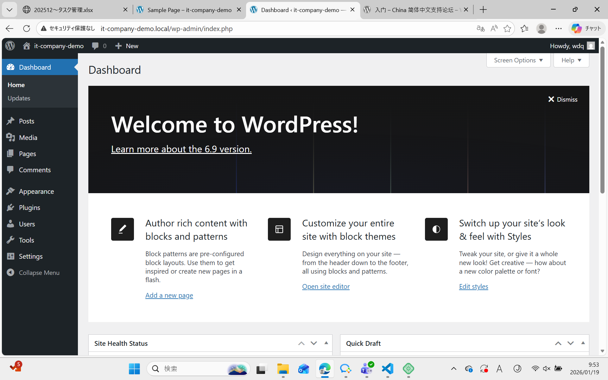
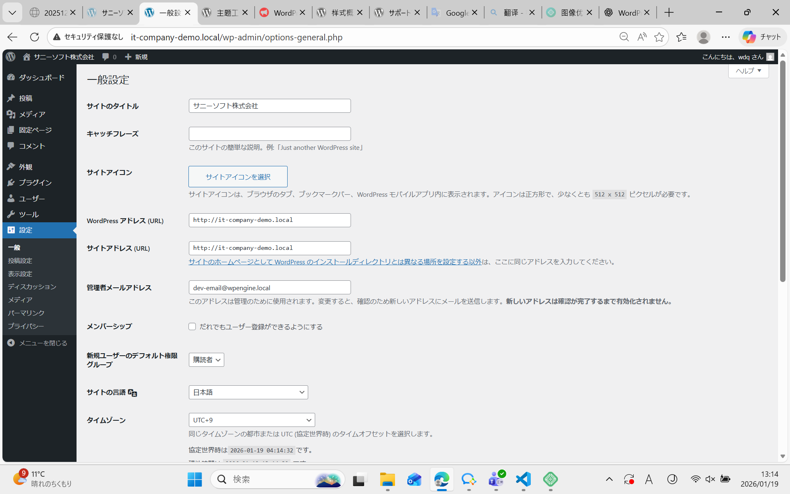
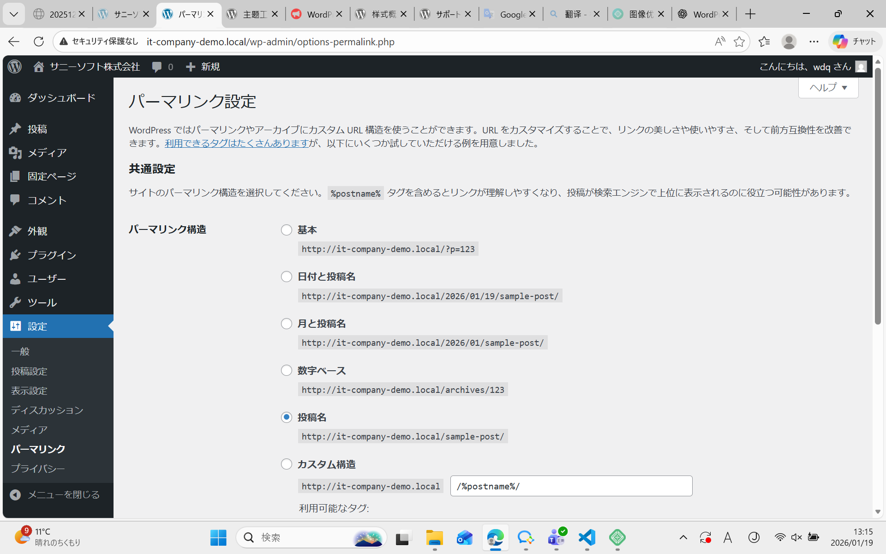

# WordPress 本地环境构建记录（Day1）

## 一、环境信息

- OS：Windows / macOS（请选择）
- Local by Flywheel 版本：v9.2.9
- PHP 版本：8.2.27
- Web Server：Nginx
- Database：MySQL
- WordPress 版本：6.9
- 站点名称：it-company-demo
- 本地站点 URL：http://it-company-demo.local

---

## 二、环境构建步骤

### 1. 安装 Local by Flywheel

1. 访问官网：https://localwp.com/
2. 下载并安装 Local by Flywheel
3. 启动 Local 应用

---

### 2. 创建 WordPress 本地站点

1. 点击「Create a new site」
2. Site name 设置为：`it-company-demo`
3. Environment 选择：Preferred
4. WordPress 管理员信息：
   - Username：admin（示例）
   - Password：********
   - Email：admin@example.com
5. 创建完成后，启动站点

---

### 3. 登录 WordPress 管理后台

- 后台地址：http://it-company-demo.local/wp-admin
- 使用创建时的管理员账号登录
- 确认 Dashboard 可正常访问

📸 **截图1：WordPress 管理后台首页**

---

## 三、WordPress 初始设置

### 1. 站点基本设置

- 站点标题：サニーソフト株式会社
- 副标题：未设置
- 语言：日本語
- 时区：东京（Tokyo）

📸 **截图2：一般设置（General Settings）页面**

---

### 2. 固定链接设置

- 设置路径：设置 → 固定链接
- 选择：「投稿名（Post name）」
- 保存更改

📸 **截图3：固定链接设置页面**

---

### 3. 清理默认内容

已删除以下默认内容：

- 示例文章（Hello World）
- 示例页面（Sample Page）
- 默认评论

---

## 四、完成确认

 ☑　WordPress 在 Local 中正常启动

 ☑　可以登录管理后台

 ☑　固定链接已设置为「投稿名」

 ☑　Git 已完成 commit 和 push

 ☑　已添加 3 张以上设置截图