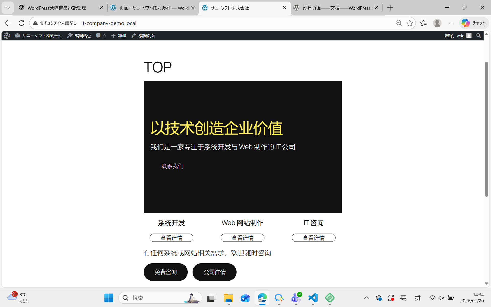
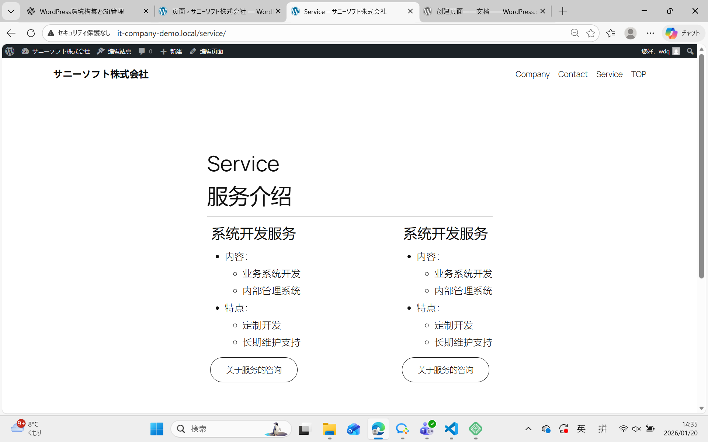
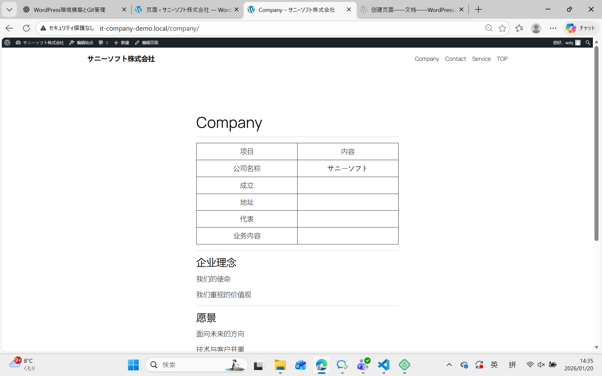
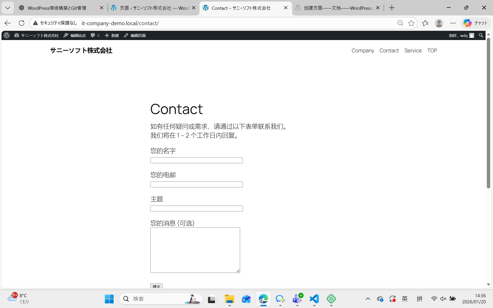

# IT企业官网｜网站结构设计书（Day2）

## 一、网站概要

- 网站类型：IT企业官网（企业形象展示）
- 目标用户：
  - 有系统开发、Web制作需求的企业
  - 正在寻找 IT 外包或技术合作伙伴的客户
- 网站目的：
  - 清晰传达公司业务内容
  - 建立专业、可信赖的企业形象
  - 引导用户进行咨询与联系

---

## 二、网站地图（Site Map）
```
TOP（首页）
├── Service（服务介绍）
├── Company（公司简介）
└── Contact（联系我们）
```
---

## 三、页面结构与内容设计

### 1. TOP 页面（首页）

**页面目的**  
- 让访问者在 5 秒内理解公司业务
- 引导用户点击咨询按钮

**主要内容结构**
1. Hero 区域
   - 公司标语（例如：以技术创造未来）
   - 公司简介一句话说明
   - CTA 按钮：「联系我们」
2. 服务概要
   - 系统开发
   - Web 制作
   - IT 咨询
3. 公司优势
   - 技术实力
   - 项目经验
   - 客户支持
4. 咨询引导 CTA
   - 「免费咨询」按钮（跳转 Contact 页面）

---

### 2. Service 页面（服务介绍）

**页面目的**  
- 清晰说明公司可提供的服务内容
- 帮助客户判断是否适合合作

**主要内容结构**
1. 服务一览
   - 系统开发服务
   - Web 网站开发
   - 维护与运营支持
2. 各服务详细说明
   - 服务内容
   - 适用客户
   - 优势特点
3. 咨询 CTA
   - 「关于服务的咨询」按钮

---

### 3. Company 页面（公司简介）

**页面目的**  
- 建立企业可信度
- 向客户展示公司背景与理念

**主要内容结构**
1. 公司信息
   - 公司名称
   - 成立时间
   - 所在地
   - 代表人
2. 企业理念
   - 公司使命
   - 价值观
3. 发展愿景
   - 面向未来的业务方向

---

### 4. Contact 页面（联系我们）

**页面目的**  
- 促使用户完成咨询行为

**主要内容结构**
1. 咨询说明文案
   - 咨询免费说明
   - 回复时间说明
2. 联系表单
   - 姓名
   - 公司名
   - 邮箱地址
   - 咨询内容
3. 隐私政策提示
   - 用户信息保护说明

---

## 四、用户动线设计（咨询导向）

1. 用户访问 TOP 页面
2. 通过 Hero 区域或服务介绍了解业务
3. 点击任意页面的 CTA 按钮
   - 「联系我们」
   - 「免费咨询」
4. 跳转至 Contact 页面
5. 提交咨询表单完成联系

---

## 五、导航菜单设计

### 1. Header（顶部菜单）

- TOP
- Service
- Company
- Contact

---

### 2. Footer（底部菜单）

- 公司信息
- 隐私政策
- 联系方式

---

## 六、完成确认

- [x] 网站地图已整理
- [x] 各页面目的与内容已定义
- [x] 用户咨询动线已设计
- [x] 菜单结构已规划完成
