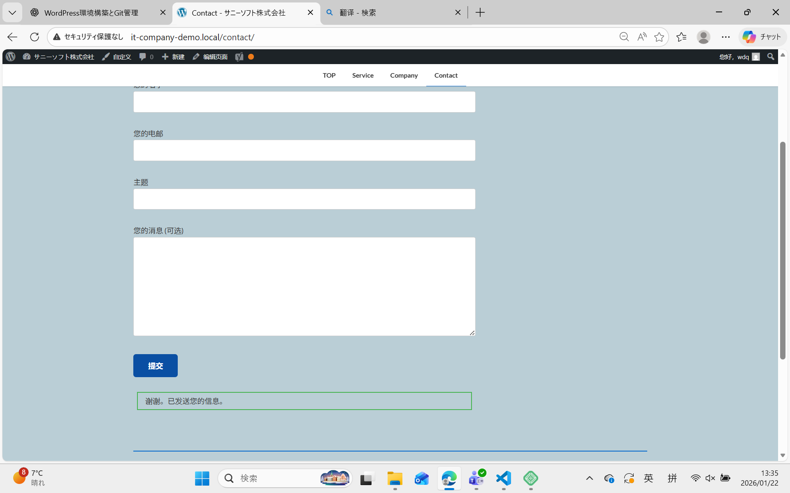
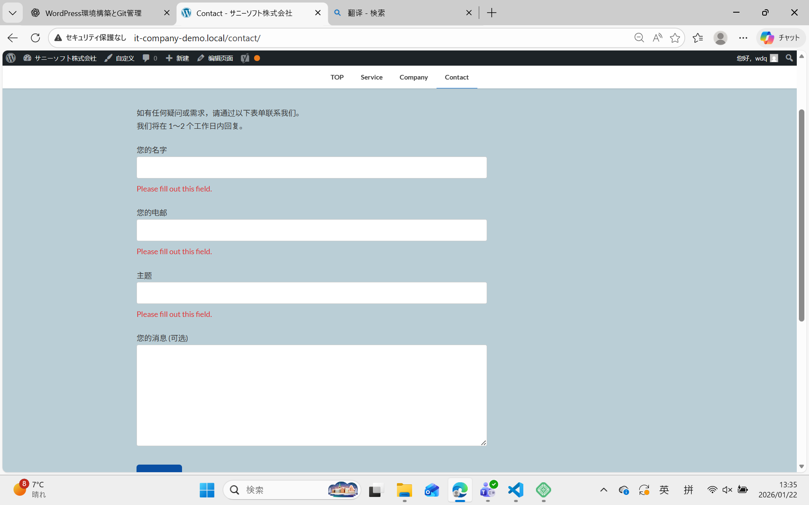
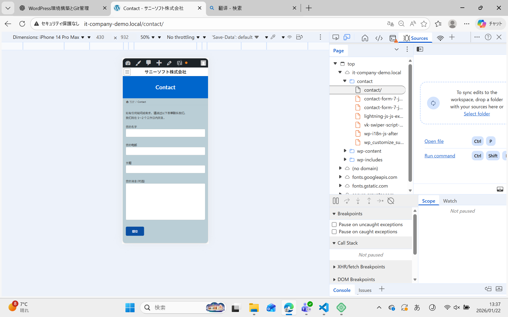

# お問い合わせフォーム動作テスト記録（Day4）

## 一、测试目的

本测试用于确认网站お問い合わせフォーム在各种使用场景下能够正常工作，包括：
- 正常提交
- 必填项校验
- 输入格式校验
- 隐私政策同意校验
- 移动端操作体验

---

## 二、测试环境

- 使用表单插件：Contact Form 7
- 测试页面：Contact（お問い合わせ）
- 测试环境：Local（本地开发环境）
- 浏览器：
  - PC
  - Mobile

---

## 三、测试用例一览

| No | 测试内容 | 预期结果 | 实际结果 | 是否通过 |
|---|---|---|---|---|
| 1 | 全项目正常输入 | 表单成功发送 | 成功发送 | ✔ |
| 2 | 必填项未输入 | 显示错误提示 | 错误提示正常 | ✔ |
| 3 | 邮箱格式不正确 | 显示格式错误 | 错误提示正常 | ✔ |
| 4 | 未勾选隐私同意 | 显示错误提示 | 错误提示正常 | ✔ |
| 5 | 手机端输入测试 | 可正常输入并发送 | 正常 | ✔ |

---

## 四、详细测试记录

---

### 测试 1：正常输入（正常系）

**测试内容**
- 所有字段均填写正确
- 勾选隐私政策同意
- 点击提交按钮

**预期结果**
- 表单成功发送
- 显示发送完成信息
- 管理员邮箱收到通知邮件
- 用户收到自动回复邮件

**测试结果**
- 表单成功发送
- 管理员邮件：收到
- 自动回复邮件：收到

📸 截图：

---

### 测试 2：必填项未输入

**测试内容**
- 不填写「お名前」
- 点击提交按钮

**预期结果**
- 显示必填项错误提示
- 表单无法提交

**测试结果**
- 错误提示正常显示
- 表单未提交

📸 截图：

---

### 测试 3：邮箱格式不正确

**测试内容**
- 邮箱地址输入：`test@@example`
- 其他项正常填写

**预期结果**
- 显示邮箱格式错误提示
- 表单无法提交

**测试结果**
- 错误提示正常显示
- 表单未提交

📸 截图：

---

### 测试 4：手机端输入测试

**测试内容**
- 切换至手机显示模式
- 实际填写并提交表单

**预期结果**
- 输入框可正常点击与输入
- 表单可正常提交
- 页面布局无错乱

**测试结果**
- 输入正常
- 提交成功
- 页面显示正常

📸 截图：

---

## 五、问题与改善点

- 本次测试中未发现重大功能问题
- 表单在 PC 与移动端均可正常使用
- 后续可考虑增加：
  - 提交确认页面
  - 防垃圾邮件（reCAPTCHA）

---

## 六、完成确认（DoD）

- [x] 表单功能测试已执行 5 种模式
- [x] 每种测试均有截图记录
- [x] 管理员通知邮件可正常接收
- [x] 自动回复邮件可正常发送
- [x] 移动端表单输入正常

---

