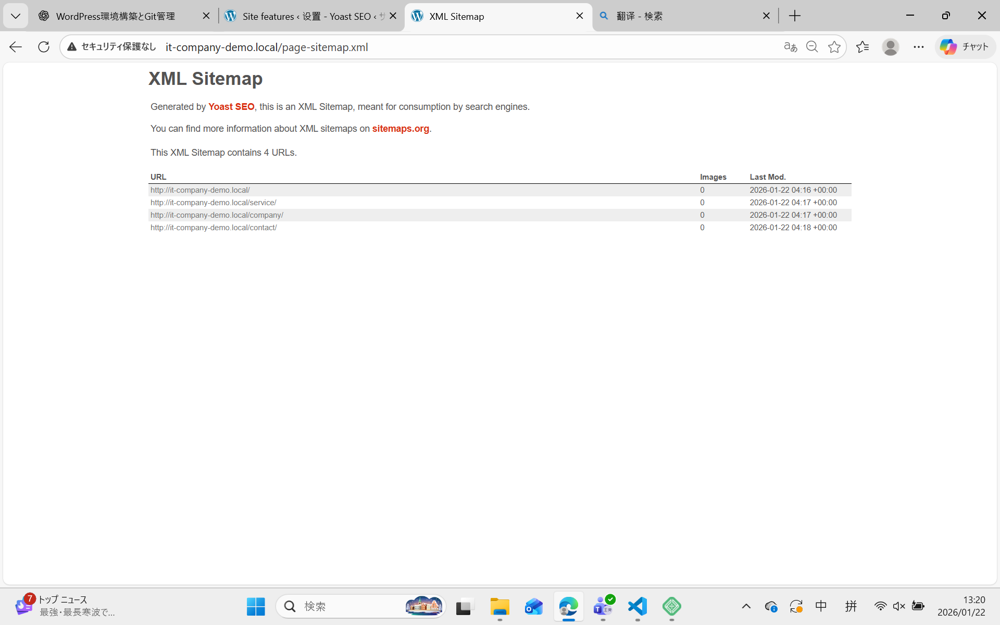

# SEO 設定記録（Day4）

## 一、目的

本文件用于记录 IT 企业官网的基础 SEO 设置内容，确保网站能够被搜索引擎正确识别，并在搜索结果及 SNS 分享时正确展示页面信息。

---

## 二、使用的 SEO 插件

- 插件名称：Yoast SEO
- 版本：最新版（免费版）
- 安装状态：已安装并启用

※ All in One SEO 与 Yoast SEO 功能类似，本项目选择 Yoast SEO 作为实现工具。

---

## 三、页面 Meta Description 设置

以下为各固定页面设置的 Meta Description 内容：

### 1. TOP 页面（首页）

- 页面标题：TOP
- Meta Description：  
  本公司是一家提供系统开发、Web 网站制作及 IT 咨询服务的专业 IT 企业，致力于以技术支持企业业务发展。

---

### 2. Service 页面（服务介绍）

- 页面标题：Service
- Meta Description：  
  提供系统开发、Web 制作及运维支持等多种 IT 服务，针对企业需求提供灵活且可靠的解决方案。

---

### 3. Company 页面（公司简介）

- 页面标题：Company
- Meta Description：  
  介绍公司基本信息、企业理念及发展愿景，致力于成为值得客户信赖的 IT 技术合作伙伴。

---

### 4. Contact 页面（联系我们）

- 页面标题：Contact
- Meta Description：  
  如有系统开发或网站制作相关需求，欢迎通过联系表单与我们取得联系，我们将尽快回复。

---

## 四、XML サイトマップ設定

- XML Sitemap 功能：启用
- Sitemap URL 示例：  
http://it-company-demo.local/page-sitemap.xml

- 确认事项：
- TOP / Service / Company / Contact 页面已包含在站点地图中
- Sitemap 可正常访问

---

## 五、OGP（SNS 分享）设置

### 基本 OGP 信息

- OGP 标题：サニーソフト株式会社
- OGP 描述：  
提供系统开发与 Web 制作服务的 IT 企业，支持企业数字化发展。
- OGP 图片：
- 尺寸：1200 × 630 px
- 内容：企业 Logo + 简洁背景
- 设置位置：Yoast SEO → Social 设置

---

## 六、SEO 设置确认清单（DoD）

- [x] SEO 插件已安装并启用
- [x] 全 4 个固定页面已设置 Meta Description
- [x] XML Sitemap 已生成并可访问
- [x] OGP 标题与描述已设置
- [x] OGP 图片已上传并显示正常

---

## 七、备注

本次 SEO 设置以「基础正确性」为目标，未进行关键词排名优化或高级 SEO 调整，后续可根据实际运营需求逐步优化。
